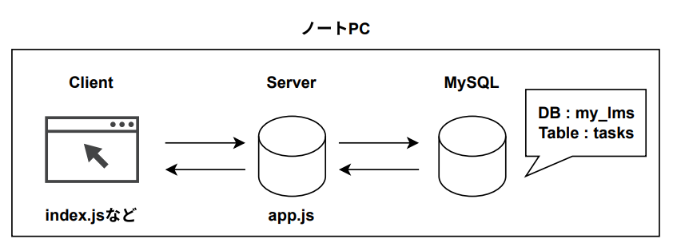
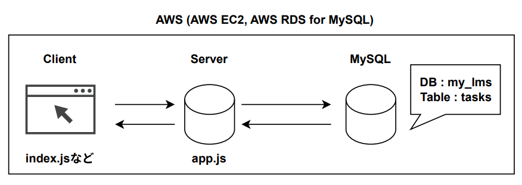
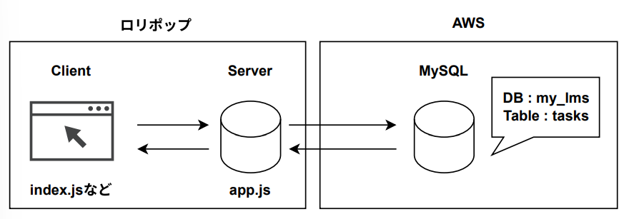

# 概要
 - 個人用のLMS (Learning Management System) 
 - 課題やタスクを登録し、課題やタスクの結果として、テキストやファイルを提出し保存できるツール
 - 通常のTodoツールとの違い
    - 主な使用目的は勉強の管理であり、あるカテゴリ(資格勉強など)に関して、期日と課題を設定することでスケジュールを立てるサポートを行う。また課題の成果をファイルやテキストの形で保存でき、後で見返すことができる。
 - 利用例
    - TOEICの勉強スケジュールを本ツールで管理する場合を考える
    - TOEICの問題集を、いつどこまで解くかを課題として登録する
    - 設定した期限までに問題を解いたpdfファイルなどをアップロードする
    - アップロードしたファイルやテキストで、スケジュールの見直しや過去の勉強を確認する

# 機能
 - 基本的な流れ
    1. 課題やタスク (カテゴリ、課題名、期限) を登録
    2. 課題の提出。テキストもしくはpdfファイルを保存可能。
    3. 課題の提出状況の表示。
    未提出、提出済み、未提出かつ期限切れ

 - その他の機能
    - 課題の削除
    - 課題内容の変更
    - トップ画面での課題の一括削除機能
    - トップ画面での課題の検索機能
 . 

# アーキテクチャ
 - バージョン1　
  
  - バージョン2
  
  - バージョン3
  

# ソースコードの説明
 - クライアント  
 index.html, index.js など
 - サーバ   
 app.js

 - 使用ライブラリ
    -  Node.js
    - PDF.js
    - express
